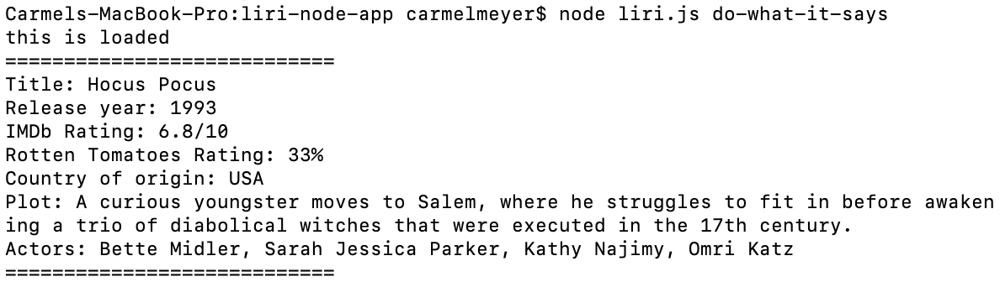

# LIRI Node App


#### APP DESCRIPTION
LIRI is a command line node app that takes in parameters and returns related data from one of three APIs - Spotify, Bands In Town or OMDB.

The GitHub repository can be found [here](https://github.com/carmel-m/liri-node-app).


---

#### INSTALLING/GETTING STARTED


1. Navigate to the root directory and type the following into the terminal:

``` shell
npm install
```

2. In order to retrieve data from Spotify, the user will need register for their own API key using the following instructions:
    * Visit <https://developer.spotify.com/my-applications/#!/>
    * Either login to your existing Spotify account or create a new one and log in
    * Once logged in, navigate to <https://developer.spotify.com/my-applications/#!/applications/create> to register a new application to be used with the Spotify API. When finished, click the "complete" button.
    * On the next screen, scroll down to find your client id and client secret. 


3. Create a `.env` file in the root directory and add the following to the file (with the 'client id' and 'client secret' created in the previous step entered in place of the values):

```js
# Spotify API keys

SPOTIFY_ID=your-spotify-id
SPOTIFY_SECRET=your-spotify-secret

```

---

#### RUNNING THE APP

1. LIRI understands the following commands:
    * `movie-this` - retrieves movie data from OMDB
    * `concert-this` - retrieves upcoming show data from Bands In Town
    * `spotify-this-song` - retrieves song data from Spotify
    * `do-what-it-says` - reads text in `random.txt` and runs the specified command
    * If **no arguments are entered**, a default message will be returned telling the user to try again.
    * If **a command is entered, but no search term** (eg. a movie name) is entered, the app will retrieve data based on preset values

2. The user can search for a movie, song, artist/band using the commands in the terminal followed by their choice of movie/song/artist.

3. Examples of the terminal commands and expected output follow:

---

**`movie-this`**
``` shell
node liri.js movie-this <enter movie name here>
```
Expected output:


---

**`concert-this`**
``` shell
node liri.js concert-this <enter artist name here>
```
Expected output:


---

**`spotify-this-song`**

``` shell
node liri.js spotify-this-song <enter song name here>
```
Expected output:


---

**`do-what-it-says`**

``` shell
node liri.js do-what-it-says
```
Expected output:


---

**`default (returned if no arguments/invalid arguments are entered)`**

``` shell
node liri.js
```
Expected output:


---

#### LANGUAGES/FRAMEWORKS/TECHNOLOGIES:
* Node.js
* APIs - Spotify, Bands In Town, OMDB
* Node packages - Spotify, Axios, Moment, DotEnv

---

#### Author:
Carmel Meyer

https://carmel-m.github.io/
